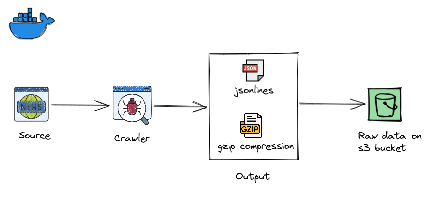

# news-crawler
### The project
This project extract textual data relating to news. The output of this crawler is particularly useful for researches with NLP, Computational Linguistics and Analytical intelligence with grouped texts. The items crawled from the website are saved as jsonlines, compressed with gzip and send to a bucket on AWS.

#### Architecture


On the `settings.py` file we have the AWS credentials configs:
```python
CREDENTIALS_PATH = Path.home() / ".credentials" / "main.json"
with open(CREDENTIALS_PATH, mode="r") as file_obj:
    CREDENTIALS = json.load(file_obj)['AWS']['app-crawler-mogiz7']

# CREDENTIALS FOR S3
AWS_ACCESS_KEY_ID = CREDENTIALS['aws_access_key_id']
AWS_SECRET_ACCESS_KEY = CREDENTIALS['aws_secret_access_key']
```

And the export feed configs:
```python
# FEED compressed jsonlines
FEED_EXPORTERS = {
    'jl.gz': 'news.exporters.JsonLinesGzipItemExporter',
}
FEED_FORMAT = 'jl.gz'
FEED_EXPORT_ENCODING = 'utf-8'
FEED_EXPORT_BATCH_ITEM_COUNT = 2000
```

This export `jl.gz` was build on `exporters.py` as `Scrapy` doesn't have native support for this type of compression yet:
```python
class JsonLinesGzipItemExporter(JsonLinesItemExporter):
    """
    SOURCE: https://github.com/scrapy/scrapy/issues/2174#issuecomment-283259507
    """

    def __init__(self, file, **kwargs):
        gzfile = gzip.GzipFile(fileobj=file, mode="wb")
        super(JsonLinesGzipItemExporter, self).__init__(gzfile, **kwargs)

    def finish_exporting(self):
        self.file.close()
```

#### Example of output jsonline file
``` python
{
   "date":"12/09/2019 18:23",
   "content":"Um dos indicadores que mais demora a se recuperar após o início da crise econômica no Brasil, em 2014, a taxa de investimentos segue nos menores patamares da história. Depois de chegar a representar 21% do PIB Brasileiro em 2013, a Formação Bruta de Capital Fixo (FBCF), medida pelo IBGE desde 1996, atingiu seu menor patamar em 2017 (14,98%) e pouco evoluiu desde então (15,83% em 2018 e 15,69% no primeiro semestre deste ano).Os números da economia do segundo trimestre do ano, divulgados na última quinta-feira (5), trouxeram algum alento: revelaram que o avanço no investimento produtivo – principalmente na construção civil, com alta de 3,2% – foi o principal fator para o crescimento de 0,4% no PIB no período. Mas logo no dia seguinte veio o balde de água fria: o anúncio do orçamento da União de 2020, com a previsão do menor investimento da história do governo federal.A debandada da União faz com que a responsabilidade pelo investimento produtivo – isto é, o gasto em obras, máquinas e equipamentos que permitam mais produção no futuro – fique ainda mais sobre as costas do setor privado. Que, por vários motivos, anda pensando várias vezes antes de aplicar seu dinheiro. A reforma tributária tem impacto positivo de alavancar a competitividade da produção nacional”, diz.O economista cita, no entanto, que conferir às reformas a responsabilidade pela recuperação do investimento é exagero. Ele comenta que a decisão de investir é mais complexa que apenas reduzir incertezas.“Além da confiança, há elementos importantes como a estrutura de financiamento. Com o encolhimento do BNDES, nosso mercado de capital não desenvolveu musculatura suficiente para compensar. Numa retomada de investimento é importante ter canais de financiamento compatíveis com a rentabilidade dos projetos. E não sabemos se nossa atual estrutura de financiamento vai funcionar num momento de expansão”, diz.",
   "author":"Roger Pereira, especial para a Gazeta do Povo",
   "title":"Queda no investimento e cautela do empresário retardam recuperação",
   "source":"Gazeta do Povo",
   "url":"https://www.gazetadopovo.com.br/republica/queda-investimento-cautela-empresario-retardam-recuperacao/",
   "created_at":"2021-11-02 15:52:51"
}
```

#### Resources
This project currently uses:
- [Python 3.9](https://www.python.org/downloads/release/python-397/)
- [Scrapy 2.5.1](https://docs.scrapy.org/en/latest/news.html#scrapy-2-5-1-2021-10-05)

**Requirements generation**
The `requirements.txt` file was generated with `pipreqs`. I don't use `pip freeze` because this saves all packages in the environment including those that you don't use in your current project. `pipreqs` generate requirements.txt file for any project based on imports. So, packages that you installed just for test and are not using will not be present on `requeriments.txt` generated by `pipreqs`.

## To run this project locally:
1. Configure your AWS Credentials to access your S3 Bucket.
You must have a AWS Account, because de output of the spider is a s3 bucket. If you have, you can set your credentions on path `/news-crawler/news/credentials.json`.
The `credentials.json` file is:
```python
{
    "AWS": {
        "app-crawler-mogiz7": {
            "aws_access_key_id": "YOUR_ACCESS_HERE",
            "aws_secret_access_key": "YOUR_ACCESS_HERE"
        }
    }
}
```
**IMPORTANT**
This is not the best way to manage credentials on production environments. It's just for tests and studies purpose. Never keep credentials on the middle of the code or in your repository! That's why the `credentials.json` file it's in `.gitignore`.

2. On the spider code the `URI` is set, you can change for your environment:
`BASE_URI = f"s3://da-vinci-raw/crawler-news/gazeta-do-povo/run={DATE}/"`

3. Enter on the `Dockerfile` (`news-crawler/news`) directory and build the image:
`docker build -t news-crawler .`

4. Run the spider:
`sudo docker run news-crawler`